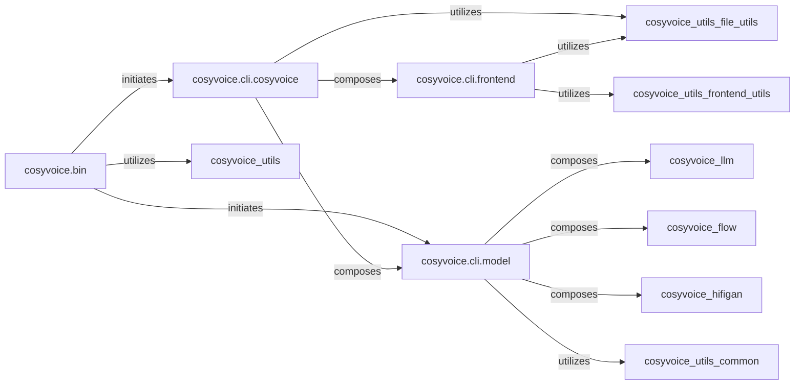

## Component Details

The Application Layer serves as the primary interface for users and external systems within the CosyVoice project. It is responsible for handling command-line arguments, orchestrating the overall execution flow for tasks such as model inference, training, and model export (JIT, ONNX), and managing the high-level setup of the system. It acts as the central coordinator, initiating interactions with other core components to fulfill user requests.

### cosyvoice.bin

This component comprises the direct executable scripts that users run to perform specific tasks like model inference, training, or export. They serve as the primary entry points for the CosyVoice system, parsing command-line arguments and initiating the respective high-level operations.

**Related Classes/Methods**:

- <a href="https://github.com/FunAudioLLM/CosyVoice/blob/master/cosyvoice/bin/inference.py#L1-L9999" target="_blank" rel="noopener noreferrer">`cosyvoice.bin.inference` (1:9999)</a>

- <a href="https://github.com/FunAudioLLM/CosyVoice/blob/master/cosyvoice/bin/train.py#L1-L9999" target="_blank" rel="noopener noreferrer">`cosyvoice.bin.train` (1:9999)</a>

- <a href="https://github.com/FunAudioLLM/CosyVoice/blob/master/cosyvoice/bin/export_jit.py#L1-L9999" target="_blank" rel="noopener noreferrer">`cosyvoice.bin.export_jit` (1:9999)</a>

- <a href="https://github.com/FunAudioLLM/CosyVoice/blob/master/cosyvoice/bin/export_onnx.py#L1-L9999" target="_blank" rel="noopener noreferrer">`cosyvoice.bin.export_onnx` (1:9999)</a>

- <a href="https://github.com/FunAudioLLM/CosyVoice/blob/master/cosyvoice/bin/average_model.py#L1-L9999" target="_blank" rel="noopener noreferrer">`cosyvoice.bin.average_model` (1:9999)</a>

- <a href="https://github.com/FunAudioLLM/CosyVoice/blob/master/cosyvoice/bin/train_dpo.py#L1-L9999" target="_blank" rel="noopener noreferrer">`cosyvoice.bin.train_dpo` (1:9999)</a>

### cosyvoice.cli.cosyvoice

This module provides the high-level Python API for interacting with the CosyVoice models. It acts as an orchestrator, managing model loading, frontend processing, and dispatching inference requests to the underlying model logic. It encapsulates different inference modes (SFT, zero-shot, cross-lingual, instruct, VC).

**Related Classes/Methods**:

- <a href="https://github.com/FunAudioLLM/CosyVoice/blob/master/cosyvoice/cli/cosyvoice.py#L1-L9999" target="_blank" rel="noopener noreferrer">`cosyvoice.cli.cosyvoice` (1:9999)</a>

### cosyvoice.cli.model

This component contains the core CosyVoiceModel and CosyVoice2Model classes. These models encapsulate the neural network architecture (LLM, Flow, Vocoder) and orchestrate their interaction to perform Text-to-Speech (TTS) and Voice Conversion (VC). They manage model loading, JIT/TensorRT optimization, and the multi-stage speech generation process, including streaming.

**Related Classes/Methods**:

- <a href="https://github.com/FunAudioLLM/CosyVoice/blob/master/cosyvoice/cli/model.py#L1-L9999" target="_blank" rel="noopener noreferrer">`cosyvoice.cli.model` (1:9999)</a>

### cosyvoice.cli.frontend

This module is responsible for all pre-processing of input data (text and speech) before it is fed into the core CosyVoiceModel. This includes text tokenization, speech tokenization, speaker embedding extraction, and text normalization, ensuring that the models receive properly formatted inputs.

**Related Classes/Methods**:

- <a href="https://github.com/FunAudioLLM/CosyVoice/blob/master/cosyvoice/cli/frontend.py#L1-L9999" target="_blank" rel="noopener noreferrer">`cosyvoice.cli.frontend` (1:9999)</a>

### [FAQ](https://github.com/CodeBoarding/GeneratedOnBoardings/tree/main?tab=readme-ov-file#faq)