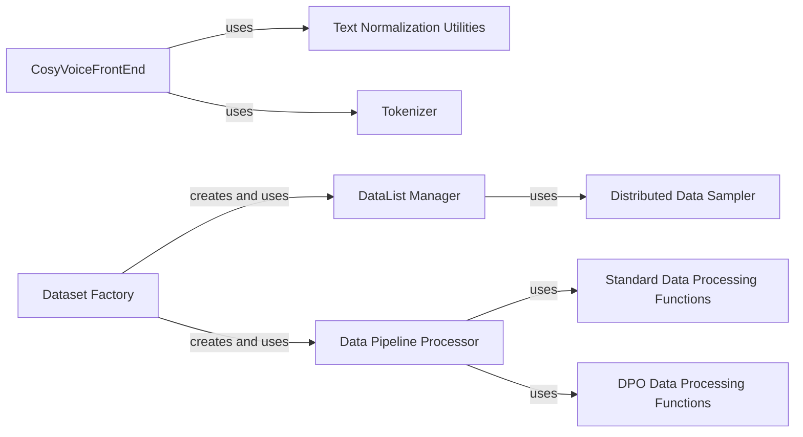

## Component Details

This subsystem is responsible for all aspects of data handling within the `CosyVoice` project, from raw input to model-ready tensors. It encompasses text normalization, tokenization, speech feature extraction, dataset loading, and efficient batching for both training and inference, ensuring data is correctly formatted and accessible for the models.

### CosyVoiceFrontEnd

This is the primary interface for preparing raw input data (text and speech) into a format suitable for CosyVoice models. It orchestrates text normalization, tokenization, speech feature extraction, and speaker embedding extraction. It acts as a crucial data pre-processing layer, ensuring that all incoming data is standardized before being fed into the models.

**Related Classes/Methods**:

- <a href="https://github.com/FunAudioLLM/CosyVoice/blob/master/cosyvoice/cli/frontend.py#L38-L214" target="_blank" rel="noopener noreferrer">`cosyvoice.cli.frontend.CosyVoiceFrontEnd` (38:214)</a>

### Text Normalization Utilities

This component provides a collection of helper functions specifically designed for text processing and normalization tasks. These utilities are leveraged by the `CosyVoiceFrontEnd` component to ensure consistent and clean text input, handling various linguistic nuances (e.g., Chinese and English normalization, punctuation handling, number spelling).

**Related Classes/Methods**:

- <a href="https://github.com/FunAudioLLM/CosyVoice/blob/master/cosyvoice/utils/frontend_utils.py#L1-L1" target="_blank" rel="noopener noreferrer">`cosyvoice.utils.frontend_utils` (1:1)</a>

### Tokenizer

This component is responsible for converting raw text into numerical tokens. This tokenization process is fundamental for natural language processing tasks within the CosyVoice system, enabling models to understand and process textual input. It's a critical step in transforming human-readable text into a machine-understandable format.

**Related Classes/Methods**:

- <a href="https://github.com/FunAudioLLM/CosyVoice/blob/master/cosyvoice/tokenizer/tokenizer.py#L1-L1" target="_blank" rel="noopener noreferrer">`cosyvoice.tokenizer.tokenizer.Tokenizer` (1:1)</a>

### Dataset Factory

This is a factory function responsible for constructing the overall dataset pipeline. It initializes the `DataList Manager` and chains various `Data Pipeline Processor` functions to create a complete data loading and processing flow for both training and inference. It handles the initial loading of data lists and applies mode-specific configurations.

**Related Classes/Methods**:

- <a href="https://github.com/FunAudioLLM/CosyVoice/blob/master/cosyvoice/dataset/dataset.py#L125-L163" target="_blank" rel="noopener noreferrer">`cosyvoice.dataset.dataset.Dataset` (125:163)</a>

### DataList Manager

Manages the list of individual data samples, providing an organized structure for accessing data. It integrates with the `Distributed Data Sampler` to ensure proper data distribution across different processes in a distributed training setup.

**Related Classes/Methods**:

- <a href="https://github.com/FunAudioLLM/CosyVoice/blob/master/cosyvoice/dataset/dataset.py#L107-L122" target="_blank" rel="noopener noreferrer">`cosyvoice.dataset.dataset.DataList` (107:122)</a>

### Distributed Data Sampler

Ensures efficient and correct data sampling in distributed training environments, preventing data duplication and ensuring even distribution across processes. It handles the logic for splitting data among different ranks and workers.

**Related Classes/Methods**:

- <a href="https://github.com/FunAudioLLM/CosyVoice/blob/master/cosyvoice/dataset/dataset.py#L51-L104" target="_blank" rel="noopener noreferrer">`cosyvoice.dataset.dataset.DistributedSampler` (51:104)</a>

### Data Pipeline Processor

This component provides a flexible mechanism for chaining multiple data processing functions. It acts as an iterable dataset that applies a sequence of transformations to the data, enabling complex and customizable data preparation pipelines.

**Related Classes/Methods**:

- <a href="https://github.com/FunAudioLLM/CosyVoice/blob/master/cosyvoice/dataset/dataset.py#L26-L48" target="_blank" rel="noopener noreferrer">`cosyvoice.dataset.dataset.Processor` (26:48)</a>

### Standard Data Processing Functions

A collection of functions that perform various standard data transformations, such as opening parquet files, filtering samples based on length, resampling audio, truncating audio, and computing acoustic features (fbank, f0). These functions are designed to be used as individual steps within the `Data Pipeline Processor`.

**Related Classes/Methods**:

- <a href="https://github.com/FunAudioLLM/CosyVoice/blob/master/cosyvoice/dataset/processor.py#L1-L1" target="_blank" rel="noopener noreferrer">`cosyvoice.dataset.processor` (1:1)</a>

### DPO Data Processing Functions

A collection of functions similar to the standard data processing functions, but specifically tailored for Direct Preference Optimization (DPO) training. These functions handle DPO-specific data loading, filtering, and feature extraction requirements, ensuring data is correctly prepared for this specialized training regime.

**Related Classes/Methods**:

- <a href="https://github.com/FunAudioLLM/CosyVoice/blob/master/cosyvoice/dataset/processor_dpo.py#L1-L1" target="_blank" rel="noopener noreferrer">`cosyvoice.dataset.processor_dpo` (1:1)</a>

### [FAQ](https://github.com/CodeBoarding/GeneratedOnBoardings/tree/main?tab=readme-ov-file#faq)