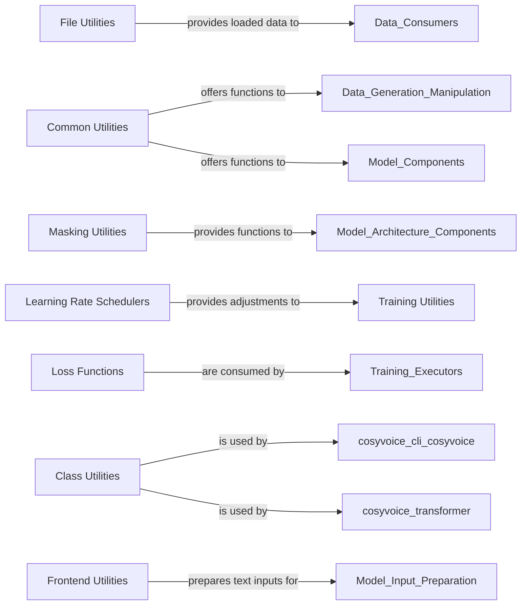

## Component Details

Abstract Components Overview of a machine learning project, detailing various utility components and their interrelationships.

### File Utilities

Manages various file input/output operations, including reading structured data (lists, JSON), loading audio files, and handling model conversion and export to different formats (e.g., ONNX to TensorRT, CosyVoice2 to VLLM). It ensures efficient loading and saving of configuration, data, and model artifacts.

**Related Classes/Methods**:

- `read_lists` (1:1)

- `read_json_lists` (1:1)

- `load_wav` (1:1)

- `convert_onnx_to_trt` (1:1)

- `export_cosyvoice2_vllm` (1:1)

### Common Utilities

Contains general-purpose helper functions and core utilities, including various sampling strategies, tensor padding, accuracy calculation, and random seed management. These methods are essential for data manipulation, generation, and other common operations used throughout the project, especially within model architectures and training.

**Related Classes/Methods**:

- `pad_list` (1:1)

- `th_accuracy` (1:1)

- `ras_sampling` (1:1)

- `nucleus_sampling` (1:1)

- `random_sampling` (1:1)

- `set_all_random_seed` (1:1)

- `mask_to_bias` (1:1)

- `TrtContextWrapper` (1:1)

### Masking Utilities

Provides functionalities for creating and applying masks, which are critical in sequence models (especially transformer architectures) to control information flow, handle variable-length inputs, and implement attention mechanisms.

**Related Classes/Methods**:

- `make_pad_mask` (1:1)

- `make_non_pad_mask` (1:1)

- `add_optional_chunk_mask` (1:1)

- `subsequent_mask` (1:1)

### Learning Rate Schedulers

Manages and adjusts the learning rate during the training of machine learning models. It implements various learning rate policies (e.g., Warmup, Annealing, Cosine, Noam) to optimize the training process and ensure stable convergence.

**Related Classes/Methods**:

- `WarmupScheduler` (1:1)

- `NoamScheduler` (1:1)

- `CosineScheduler` (1:1)

- `AnnealingScheduler` (1:1)

### Loss Functions

Defines various loss functions used to quantify the error of a model during training. This includes standard loss functions (`losses.py`) and those specific to Direct Preference Optimization (DPO) (`losses_dpo.py`), which are crucial for guiding model optimization.

**Related Classes/Methods**:

- `L1Loss` (1:1)

- `MSELoss` (1:1)

- `LogitsLoss` (1:1)

- `DPOLoss` (1:1)

### Class Utilities

Provides utilities for dynamic class handling, instantiation, and potentially registration. This is particularly useful for modular architectures where components (like transformer layers, activations, embeddings) might be dynamically loaded or configured based on configuration.

**Related Classes/Methods**:

- `get_class_from_path` (1:1)

- `get_all_classes_from_path` (1:1)

- `get_all_classes_from_module` (1:1)

### Frontend Utilities

Focuses on preprocessing input data, specifically text, by splitting it into manageable segments. This is a common initial step in text-to-speech or natural language processing pipelines before data is fed into the main model.

**Related Classes/Methods**:

- `split_text_into_sentences` (1:1)

### Training Utilities

Contains core helper functions and logic for the machine learning model training loop. This includes functionalities related to data handling within the training context, gradient accumulation, and interactions with learning rate schedulers. It provides the backbone for both standard and DPO training processes.

**Related Classes/Methods**:

- `AverageMeter` (1:1)

- `set_grad_enabled` (1:1)

- `get_grad_norm` (1:1)

- `get_logger` (1:1)

- `get_model_info` (1:1)

- `save_checkpoint` (1:1)

- `load_checkpoint` (1:1)

- `get_latest_checkpoint` (1:1)

- `get_model_state_dict` (1:1)

- `get_optimizer_state_dict` (1:1)

- `get_scheduler_state_dict` (1:1)

- `get_scaler_state_dict` (1:1)

- `get_model_state_dict_with_prefix` (1:1)

- `get_optimizer_state_dict_with_prefix` (1:1)

- `get_scheduler_state_dict_with_prefix` (1:1)

- `get_scaler_state_dict_with_prefix` (1:1)

- `get_model_state_dict_without_prefix` (1:1)

- `get_optimizer_state_dict_without_prefix` (1:1)

- `get_scheduler_state_dict_without_prefix` (1:1)

- `get_scaler_state_dict_without_prefix` (1:1)

- `get_model_state_dict_with_prefix_and_without_prefix` (1:1)

- `get_optimizer_state_dict_with_prefix_and_without_prefix` (1:1)

- `get_scheduler_state_dict_with_prefix_and_without_prefix` (1:1)

- `get_scaler_state_dict_with_prefix_and_without_prefix` (1:1)

### [FAQ](https://github.com/CodeBoarding/GeneratedOnBoardings/tree/main?tab=readme-ov-file#faq)