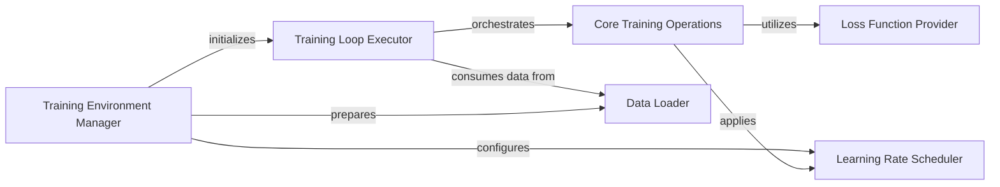

## Component Details

The Training Management subsystem is the core orchestrator of the model training process. It encompasses everything from setting up the distributed training environment to executing the training loop, managing model updates, and handling logging and checkpointing. It is designed to be flexible, supporting both standard and Direct Preference Optimization (DPO) training paradigms.

### Training Loop Executor

This component is the central control unit for the entire training process. It orchestrates the iteration over epochs and data batches, manages the training and cross-validation cycles, and coordinates the forward and backward passes. It includes specialized logic for both standard and DPO training, handling aspects like gradient accumulation and distributed training synchronization.

**Related Classes/Methods**:

- <a href="https://github.com/FunAudioLLM/CosyVoice/blob/master/cosyvoice/utils/executor.py#L0-L0" target="_blank" rel="noopener noreferrer">`cosyvoice.utils.executor` (0:0)</a>

- <a href="https://github.com/FunAudioLLM/CosyVoice/blob/master/cosyvoice/utils/executor_dpo.py#L0-L0" target="_blank" rel="noopener noreferrer">`cosyvoice.utils.executor_dpo` (0:0)</a>

### Training Environment Manager

This component is responsible for setting up the foundational environment required for training. This includes initializing distributed training (e.g., PyTorch DDP or DeepSpeed), configuring and loading datasets, preparing optimizers, and setting up learning rate schedulers. It ensures that the training infrastructure is correctly configured before the training loop begins.

**Related Classes/Methods**:

- <a href="https://github.com/FunAudioLLM/CosyVoice/blob/master/cosyvoice/utils/train_utils.py#L0-L0" target="_blank" rel="noopener noreferrer">`cosyvoice.utils.train_utils` (0:0)</a>

- <a href="https://github.com/FunAudioLLM/CosyVoice/blob/master/cosyvoice/utils/train_utils_dpo.py#L0-L0" target="_blank" rel="noopener noreferrer">`cosyvoice.utils.train_utils_dpo` (0:0)</a>

### Core Training Operations

This component encapsulates the fundamental, per-step operations within the training loop. It handles the forward pass (model inference and loss computation), the backward pass (gradient calculation), the update of model parameters based on gradients, and the management of gradient clipping. It also includes utilities for logging training metrics and saving model checkpoints.

**Related Classes/Methods**:

- <a href="https://github.com/FunAudioLLM/CosyVoice/blob/master/cosyvoice/utils/train_utils.py#L0-L0" target="_blank" rel="noopener noreferrer">`cosyvoice.utils.train_utils` (0:0)</a>

- <a href="https://github.com/FunAudioLLM/CosyVoice/blob/master/cosyvoice/utils/train_utils_dpo.py#L0-L0" target="_blank" rel="noopener noreferrer">`cosyvoice.utils.train_utils_dpo` (0:0)</a>

### Loss Function Provider

This component defines and computes the various loss functions used to quantify the error between the model's predictions and the actual targets. It includes both general-purpose loss functions and specialized implementations for Direct Preference Optimization (DPO), providing the essential feedback signal for model learning.

**Related Classes/Methods**:

- <a href="https://github.com/FunAudioLLM/CosyVoice/blob/master/cosyvoice/utils/losses.py#L0-L0" target="_blank" rel="noopener noreferrer">`cosyvoice.utils.losses` (0:0)</a>

- <a href="https://github.com/FunAudioLLM/CosyVoice/blob/master/cosyvoice/utils/losses_dpo.py#L0-L0" target="_blank" rel="noopener noreferrer">`cosyvoice.utils.losses_dpo` (0:0)</a>

### Learning Rate Scheduler

This component implements strategies for dynamically adjusting the learning rate of the optimizer throughout the training process. It includes various scheduling policies like warmup, noam annealing, or constant rates, which are crucial for achieving stable convergence and optimal model performance.

**Related Classes/Methods**:

- <a href="https://github.com/FunAudioLLM/CosyVoice/blob/master/cosyvoice/utils/scheduler.py#L0-L0" target="_blank" rel="noopener noreferrer">`cosyvoice.utils.scheduler` (0:0)</a>

### Data Loader

This component is responsible for efficiently loading, preprocessing, and batching the training and validation data. It provides an iterable interface to the datasets, ensuring that data is fed to the model in an optimized manner for training.

**Related Classes/Methods**:

- <a href="https://github.com/FunAudioLLM/CosyVoice/blob/master/cosyvoice/dataset/dataset.py#L0-L0" target="_blank" rel="noopener noreferrer">`cosyvoice.dataset.dataset` (0:0)</a>

### [FAQ](https://github.com/CodeBoarding/GeneratedOnBoardings/tree/main?tab=readme-ov-file#faq)