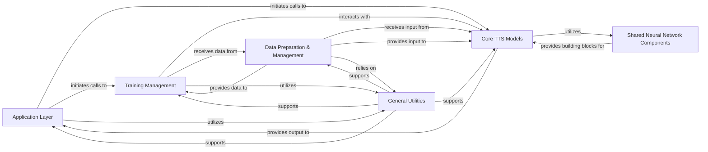

## Component Details

The `CosyVoice` architecture is logically decomposed into six fundamental components, each with distinct responsibilities, ensuring a modular, scalable, and maintainable system for Text-to-Speech (TTS) synthesis.

### Application Layer

This component serves as the primary interface for users and external systems. It handles command-line arguments, orchestrates the overall execution flow for tasks such as model inference, training, and model export (JIT, ONNX), and manages the high-level setup of the system. It acts as the central coordinator, initiating interactions with other core components.

**Related Classes/Methods**:

- <a href="https://github.com/FunAudioLLM/CosyVoice/blob/master/cosyvoice/bin/inference.py#L1-L1" target="_blank" rel="noopener noreferrer">`cosyvoice.bin.inference` (1:1)</a>

- <a href="https://github.com/FunAudioLLM/CosyVoice/blob/master/cosyvoice/bin/train.py#L1-L1" target="_blank" rel="noopener noreferrer">`cosyvoice.bin.train` (1:1)</a>

- <a href="https://github.com/FunAudioLLM/CosyVoice/blob/master/cosyvoice/bin/export_jit.py#L1-L1" target="_blank" rel="noopener noreferrer">`cosyvoice.bin.export_jit` (1:1)</a>

- <a href="https://github.com/FunAudioLLM/CosyVoice/blob/master/cosyvoice/cli/cosyvoice.py#L1-L1" target="_blank" rel="noopener noreferrer">`cosyvoice.cli.cosyvoice` (1:1)</a>

- <a href="https://github.com/FunAudioLLM/CosyVoice/blob/master/cosyvoice/cli/model.py#L1-L1" target="_blank" rel="noopener noreferrer">`cosyvoice.cli.model` (1:1)</a>

### Core TTS Models

This is the heart of the text-to-speech system, encompassing the entire speech synthesis pipeline. It integrates and orchestrates the linguistic model (LLM), the acoustic model (Flow-based Generative Models), and the vocoder (HiFi-GAN) to transform text and speaker information into high-fidelity audio. It handles model loading and the core `tts` functionality.

**Related Classes/Methods**:

- <a href="https://github.com/FunAudioLLM/CosyVoice/blob/master/cosyvoice/cli/model.py#L1-L1" target="_blank" rel="noopener noreferrer">`cosyvoice.cli.model` (1:1)</a>

- <a href="https://github.com/FunAudioLLM/CosyVoice/blob/master/cosyvoice/llm/llm.py#L1-L1" target="_blank" rel="noopener noreferrer">`cosyvoice.llm.llm` (1:1)</a>

- <a href="https://github.com/FunAudioLLM/CosyVoice/blob/master/cosyvoice/llm/llm_dpo.py#L1-L1" target="_blank" rel="noopener noreferrer">`cosyvoice.llm.llm_dpo` (1:1)</a>

- <a href="https://github.com/FunAudioLLM/CosyVoice/blob/master/cosyvoice/flow/decoder.py#L1-L1" target="_blank" rel="noopener noreferrer">`cosyvoice.flow.decoder` (1:1)</a>

- <a href="https://github.com/FunAudioLLM/CosyVoice/blob/master/cosyvoice/flow/flow.py#L1-L1" target="_blank" rel="noopener noreferrer">`cosyvoice.flow.flow` (1:1)</a>

- <a href="https://github.com/FunAudioLLM/CosyVoice/blob/master/cosyvoice/flow/flow_matching.py#L1-L1" target="_blank" rel="noopener noreferrer">`cosyvoice.flow.flow_matching` (1:1)</a>

- <a href="https://github.com/FunAudioLLM/CosyVoice/blob/master/cosyvoice/hifigan/generator.py#L1-L1" target="_blank" rel="noopener noreferrer">`cosyvoice.hifigan.generator` (1:1)</a>

- <a href="https://github.com/FunAudioLLM/CosyVoice/blob/master/cosyvoice/hifigan/discriminator.py#L1-L1" target="_blank" rel="noopener noreferrer">`cosyvoice.hifigan.discriminator` (1:1)</a>

- <a href="https://github.com/FunAudioLLM/CosyVoice/blob/master/cosyvoice/hifigan/hifigan.py#L1-L1" target="_blank" rel="noopener noreferrer">`cosyvoice.hifigan.hifigan` (1:1)</a>

### Data Preparation & Management

Responsible for all aspects of data handling, from raw input to model-ready tensors. This includes text normalization, tokenization, speech feature extraction, dataset loading, and efficient batching for both training and inference. It ensures data is correctly formatted and accessible for the models.

**Related Classes/Methods**:

- <a href="https://github.com/FunAudioLLM/CosyVoice/blob/master/cosyvoice/cli/frontend.py#L1-L1" target="_blank" rel="noopener noreferrer">`cosyvoice.cli.frontend` (1:1)</a>

- <a href="https://github.com/FunAudioLLM/CosyVoice/blob/master/cosyvoice/dataset/dataset.py#L1-L1" target="_blank" rel="noopener noreferrer">`cosyvoice.dataset.dataset` (1:1)</a>

- <a href="https://github.com/FunAudioLLM/CosyVoice/blob/master/cosyvoice/dataset/processor.py#L1-L1" target="_blank" rel="noopener noreferrer">`cosyvoice.dataset.processor` (1:1)</a>

- <a href="https://github.com/FunAudioLLM/CosyVoice/blob/master/cosyvoice/dataset/processor_dpo.py#L1-L1" target="_blank" rel="noopener noreferrer">`cosyvoice.dataset.processor_dpo` (1:1)</a>

- <a href="https://github.com/FunAudioLLM/CosyVoice/blob/master/cosyvoice/tokenizer/tokenizer.py#L1-L1" target="_blank" rel="noopener noreferrer">`cosyvoice.tokenizer.tokenizer` (1:1)</a>

### Training Management

Orchestrates the entire training process, including setting up distributed training environments, managing training loops, performing forward and backward passes, updating model parameters, handling logging, and saving model checkpoints. It supports both standard and DPO (Direct Preference Optimization) training.

**Related Classes/Methods**:

- <a href="https://github.com/FunAudioLLM/CosyVoice/blob/master/cosyvoice/utils/executor.py#L1-L1" target="_blank" rel="noopener noreferrer">`cosyvoice.utils.executor` (1:1)</a>

- <a href="https://github.com/FunAudioLLM/CosyVoice/blob/master/cosyvoice/utils/executor_dpo.py#L1-L1" target="_blank" rel="noopener noreferrer">`cosyvoice.utils.executor_dpo` (1:1)</a>

- <a href="https://github.com/FunAudioLLM/CosyVoice/blob/master/cosyvoice/utils/train_utils.py#L1-L1" target="_blank" rel="noopener noreferrer">`cosyvoice.utils.train_utils` (1:1)</a>

- <a href="https://github.com/FunAudioLLM/CosyVoice/blob/master/cosyvoice/utils/train_utils_dpo.py#L1-L1" target="_blank" rel="noopener noreferrer">`cosyvoice.utils.train_utils_dpo` (1:1)</a>

### Shared Neural Network Components

This component provides fundamental, reusable building blocks for neural network architectures, particularly those based on transformers and conformers. It encapsulates common layers, attention mechanisms, and embeddings that are utilized by various models within the `Core TTS Models` component.

**Related Classes/Methods**:

- <a href="https://github.com/FunAudioLLM/CosyVoice/blob/master/cosyvoice/transformer/encoder.py#L1-L1" target="_blank" rel="noopener noreferrer">`cosyvoice.transformer.encoder` (1:1)</a>

- <a href="https://github.com/FunAudioLLM/CosyVoice/blob/master/cosyvoice/transformer/decoder.py#L1-L1" target="_blank" rel="noopener noreferrer">`cosyvoice.transformer.decoder` (1:1)</a>

- <a href="https://github.com/FunAudioLLM/CosyVoice/blob/master/cosyvoice/transformer/attention.py#L1-L1" target="_blank" rel="noopener noreferrer">`cosyvoice.transformer.attention` (1:1)</a>

- <a href="https://github.com/FunAudioLLM/CosyVoice/blob/master/cosyvoice/transformer/embedding.py#L1-L1" target="_blank" rel="noopener noreferrer">`cosyvoice.transformer.embedding` (1:1)</a>

- <a href="https://github.com/FunAudioLLM/CosyVoice/blob/master/cosyvoice/transformer/positionwise_feed_forward.py#L1-L1" target="_blank" rel="noopener noreferrer">`cosyvoice.transformer.positionwise_feed_forward` (1:1)</a>

- <a href="https://github.com/FunAudioLLM/CosyVoice/blob/master/cosyvoice/transformer/subsampling.py#L1-L1" target="_blank" rel="noopener noreferrer">`cosyvoice.transformer.subsampling` (1:1)</a>

### General Utilities

A collection of miscellaneous helper functions and common utilities used across the entire project. This includes mathematical operations, file I/O, masking utilities, learning rate schedulers, and various loss functions. It serves as a foundational support layer for other components.

**Related Classes/Methods**:

- <a href="https://github.com/FunAudioLLM/CosyVoice/blob/master/cosyvoice/utils/common.py#L1-L1" target="_blank" rel="noopener noreferrer">`cosyvoice.utils.common` (1:1)</a>

- <a href="https://github.com/FunAudioLLM/CosyVoice/blob/master/cosyvoice/utils/file_utils.py#L1-L1" target="_blank" rel="noopener noreferrer">`cosyvoice.utils.file_utils` (1:1)</a>

- <a href="https://github.com/FunAudioLLM/CosyVoice/blob/master/cosyvoice/utils/mask.py#L1-L1" target="_blank" rel="noopener noreferrer">`cosyvoice.utils.mask` (1:1)</a>

- <a href="https://github.com/FunAudioLLM/CosyVoice/blob/master/cosyvoice/utils/scheduler.py#L1-L1" target="_blank" rel="noopener noreferrer">`cosyvoice.utils.scheduler` (1:1)</a>

- <a href="https://github.com/FunAudioLLM/CosyVoice/blob/master/cosyvoice/utils/losses.py#L1-L1" target="_blank" rel="noopener noreferrer">`cosyvoice.utils.losses` (1:1)</a>

- <a href="https://github.com/FunAudioLLM/CosyVoice/blob/master/cosyvoice/utils/losses_dpo.py#L1-L1" target="_blank" rel="noopener noreferrer">`cosyvoice.utils.losses_dpo` (1:1)</a>

- <a href="https://github.com/FunAudioLLM/CosyVoice/blob/master/cosyvoice/utils/class_utils.py#L1-L1" target="_blank" rel="noopener noreferrer">`cosyvoice.utils.class_utils` (1:1)</a>

- <a href="https://github.com/FunAudioLLM/CosyVoice/blob/master/cosyvoice/utils/frontend_utils.py#L1-L1" target="_blank" rel="noopener noreferrer">`cosyvoice.utils.frontend_utils` (1:1)</a>

### [FAQ](https://github.com/CodeBoarding/GeneratedOnBoardings/tree/main?tab=readme-ov-file#faq)