<div align="center">
    <svg width="200" height="200" viewBox="0 0 200 200" xmlns="http://www.w3.org/2000/svg">
        <!-- 渐变定义 -->
        <defs>
            <linearGradient id="mainGradient" x1="0%" y1="0%" x2="100%" y2="100%">
                <stop offset="0%" style="stop-color:#4A90E2;stop-opacity:1" />
                <stop offset="100%" style="stop-color:#45E2A0;stop-opacity:1" />
            </linearGradient>
            <linearGradient id="waveGradient" x1="0%" y1="0%" x2="100%" y2="0%">
                <stop offset="0%" style="stop-color:#4A90E2;stop-opacity:0.8" />
                <stop offset="100%" style="stop-color:#45E2A0;stop-opacity:0.8" />
            </linearGradient>
        </defs>
        <!-- 背景图形 -->
        <circle cx="100" cy="100" r="90" fill="url(#mainGradient)" opacity="0.1"/>
        <circle cx="100" cy="100" r="70" fill="none" stroke="url(#waveGradient)" stroke-width="0.5" opacity="0.3"/>
        <circle cx="100" cy="100" r="50" fill="none" stroke="url(#waveGradient)" stroke-width="0.5" opacity="0.3"/>
        <!-- 装饰性几何图形 -->
        <g transform="translate(100 100)">
            <rect x="-40" y="-40" width="80" height="80" 
                  fill="none" stroke="url(#waveGradient)" 
                  stroke-width="0.5" opacity="0.2" 
                  transform="rotate(45)"/>
            <rect x="-30" y="-30" width="60" height="60" 
                  fill="none" stroke="url(#waveGradient)" 
                  stroke-width="0.5" opacity="0.2" 
                  transform="rotate(45)"/>
        </g>
        <!-- 现代化书本形状 -->
        <path d="M65 65 
                 C65 65, 90 60, 135 65 
                 L135 125 
                 C90 120, 65 125, 65 125 
                 C60 125, 55 120, 55 115 
                 L55 75 
                 C55 70, 60 65, 65 65 Z" 
              fill="url(#mainGradient)"
              opacity="0.8"/>
        <!-- 书本内部纹理 -->
        <path d="M70 75 L120 75" stroke="white" stroke-width="1" opacity="0.3"/>
        <path d="M70 85 L125 85" stroke="white" stroke-width="1" opacity="0.3"/>
        <path d="M70 95 L115 95" stroke="white" stroke-width="1" opacity="0.3"/>
        <path d="M70 105 L120 105" stroke="white" stroke-width="1" opacity="0.3"/>
        <!-- 静态声音波纹 -->
        <g stroke="url(#waveGradient)" stroke-width="2" fill="none">
            <path d="M140 85 Q155 100 140 115" opacity="0.8"/>
            <path d="M150 75 Q170 100 150 125" opacity="0.6"/>
            <path d="M160 65 Q185 100 160 135" opacity="0.4"/>
        </g>
        <!-- 额外的装饰元素 -->
        <circle cx="140" cy="100" r="3" fill="url(#mainGradient)" opacity="0.8"/>
        <circle cx="150" cy="100" r="2" fill="url(#mainGradient)" opacity="0.6"/>
        <circle cx="160" cy="100" r="1" fill="url(#mainGradient)" opacity="0.4"/>
        <!-- 点缀装饰 -->
        <circle cx="70" cy="65" r="1" fill="white" opacity="0.5"/>
        <circle cx="130" cy="65" r="1" fill="white" opacity="0.5"/>
        <circle cx="100" cy="60" r="1" fill="white" opacity="0.5"/>
        <!-- 文字 -->
        <text x="100" y="150" 
              font-family="'Signika Negative', 'Segoe UI', Arial, sans-serif" 
              font-size="20" 
              fill="url(#mainGradient)" 
              text-anchor="middle" 
              font-weight="400"
              letter-spacing="1">
            EduVoiceLab
        </text>
    </svg>
    <h1>EduVoiceLab</h1>
    <h2>基于 AI 语音合成的教学声音处理软件</h2>
</div>

## 📖 项目介绍

EduVoiceLab 是一个创新的教育科技项目，致力于将 AI 语音合成技术应用于教育领域。通过TTS声音克隆和文本转语音，为教育工作者和学习者提供个性化的语音解决方案。

### 🌟 核心特性

- 🎯 声音样本库管理
- 🔊 个性化语音讲解
- 📚 标准语言输出
- 🎥 声音置换与字幕生成

## 🚀 快速开始

### 环境要求

- Python 3.10+
- Conda 3.10+
- PyTorch 1.10+
- CUDA 11.0+ (GPU 支持)
- FFmpeg
- ModelScope SDK
- 8GB+ RAM

### ⚙️安装步骤

在开始安装前，请先配置好环境变量。

#### 1\. 克隆仓库

使用以下命令克隆项目仓库并初始化子模块：

```bash
git clone --recursive https://github.com/HatsuChuwu/EduVoiceLab.git
cd EduVoiceLab
git submodule update --init --recursive
```

#### 2\. 安装和配置 Conda

* **安装 Conda**：请访问 [https://docs.conda.io/en/latest/miniconda.html](https://docs.conda.io/en/latest/miniconda.html) 按照指引进行安装。
* **创建 Conda 环境**：在命令行中执行以下命令，创建名为 `cosyvoice` 的 Conda 环境并激活：

```bash
conda create -n cosyvoice -y python=3.10
conda activate cosyvoice
```

#### 3\. 安装依赖

你可以选择以下两种方式之一来安装项目所需的依赖：

* **常规安装**：

```bash
pip install -r requirements.txt
```

* **使用阿里云镜像安装**：

```bash
pip install -r requirements.txt -i https://mirrors.aliyun.com/pypi/simple/ --trusted-host=mirrors.aliyun.com
```

#### 4\. 模型下载

推荐下载预训练的 CosyVoice2-0.5B、CosyVoice-300M 等模型及 CosyVoice-ttsfrd 资源。使用以下 Python 代码进行 SDK 模型下载：

```python
from modelscope import snapshot_download

snapshot_download('iic/CosyVoice2-0.5B', local_dir='pretrained_models/CosyVoice2-0.5B')
snapshot_download('iic/CosyVoice-300M', local_dir='pretrained_models/CosyVoice-300M')
snapshot_download('iic/CosyVoice-300M-25Hz', local_dir='pretrained_models/CosyVoice-300M-25Hz')
snapshot_download('iic/CosyVoice-300M-SFT', local_dir='pretrained_models/CosyVoice-300M-SFT')
snapshot_download('iic/CosyVoice-300M-Instruct', local_dir='pretrained_models/CosyVoice-300M-Instruct')
snapshot_download('iic/CosyVoice-ttsfrd', local_dir='pretrained_models/CosyVoice-ttsfrd')
```

#### 5\. 启动应用

在激活的 `cosyvoice` Conda 环境下，使用以下命令启动应用：

```bash
python run webui.py
```

#### 6\. 可能出现的问题及解决方法

* **缺少 'matcha' 模块错误**：如果启动时出现 `pydoc.ErrorDuringImport: problem in cosyvoice.flow.flow_matching - ModuleNotFoundError: No module named 'matcha'` 错误，请检查 `CosyVoice-main\third_party\Matcha-TTS` 目录下是否有文件。在官方 Git 项目中这部分使用了外链。若没有文件，你可以自行下载压缩包并解压。另外，自 2025 年 3 月 21 日起，你可以直接执行 `pip install matcha-tts` 下载 Matcha-TTS，而无需手动拉取源项目。相关链接：[Matcha-TTS/configs at dd9105b34bf2be2230f4aa1e4769fb586a3c824e · shivammehta25/Matcha-TTS · GitHub](https://github.com/shivammehta25/Matcha-TTS/tree/dd9105b34bf2be2230f4aa1e4769fb586a3c824e/configs)。
* **预训练音色为空的情况**：若 `CosyVoice2-0.5B` 缺少 `spk2info.pt` 文件（参考 [议题 #729・FunAudioLLM/CosyVoice](https://github.com/FunAudioLLM/CosyVoice/issues/729)），你需要手动下载 `spk2info.pt` 文件，并将其粘贴到 `pretrained_models/CosyVoice2-0.5B` 目录中。完成后，重新运行 `webui.py` 即可看到预训练模型。

## 💡 主要功能

### 声音样本库

- 预设标准声音模板
- 支持音频文件上传（＜30s）
- 实时录音功能
- 声音特征提取与存储
- 声音置换

### 语音合成

- 支持文本转语音
- 多种语言支持（中文、英文、粤语等）
- 可调节语速、语气和节奏
- 高达85%以上的声音相似度
- 系统实时响应时间不超过2秒(合成时间则取决于设备硬件配置)

### ~~课件制作~~

- ~~支持PPT课件导入（3M-20M）~~
- ~~智能配音生成~~
- ~~课件导出功能~~
- ~~支持多种格式转换~~

## 📊 性能指标

| 指标       | 要求   | 实际表现 |
| -------- | ---- | ---- |
| 声音相似度    | ≥85% | 87%  |
| 自然度(MOS) | ≥4.0 | 4.2  |
| 清晰度      | ≥0.8 | 0.85 |
| 响应时间     | ≤2s  | 1.5s |

## 🛠️ 技术架构

### 模型基础

* **核心模型**：CosyVoice2 基于大语言模型实现可扩展流式语音合成，对 CosyVoice 进行了升级，包括模型精简消融、提高码本利用率、实现无损流式合成、语义 - 声学解耦建模以及整合指令和零样本能力。此模型的开发运用了 PyTorch 框架，借助其强大的自动求导、张量计算以及丰富的神经网络层模块，构建并训练复杂的语音合成模型架构。
* **设计理念**：分离语音信号的语义和声学信息并独立建模，语音生成过程为逐步的语义解码过程，逐步引入条件信息。PyTorch 为这种复杂的建模理念提供了灵活的实现方式，例如可以方便地定义不同的神经网络模块来分别处理语义和声学信息。

### 前端（输入处理）

* **文本 tokenizer**：
  * **输入方式**：直接使用原始文本作为输入，通过基于字节对编码（Byte Pair Encoding, BPE）的文本 tokenizer 进行 token 化，无需图音转换（Grapheme-to-Phoneme, g2p）获取音素的前端模型。
  * **特殊处理**：屏蔽一对多的 token，防止 token 发音过长和减少数据稀疏性引起的边缘情况，如对编码多个中文字符的 BPE token 进行屏蔽，每个字符分别编码，英语、日语和韩语不做特殊处理。
* **Web UI**
  * **Python 实现**：
    * **主题定制**：seafoam_theme.py 文件定义了一个名为 `Seafoam` 的自定义 Gradio 主题类，继承自 `Base` 类。在 `__init__` 方法中，设置了主题的主要色调、次要色调、中性色调、间距大小、圆角大小、文本大小、字体等参数。还通过 `super().set` 方法进一步设置了主题的具体样式，如背景填充、按钮颜色、滑块颜色等。最后创建了 `Seafoam` 主题的实例 `seafoam`，供 `webui.py` 使用，为整个 Web 界面赋予独特的视觉效果。
    * **界面构建与交互**：webui.py 文件基于 Gradio 库构建了一个名为 “育音 EduVoiceLab” 的语音合成 Web 界面。导入了 `seafoam` 主题实例并应用到界面中。定义了多个辅助函数，如 `generate_seed` 用于生成随机推理种子，`postprocess` 对语音数据进行后处理，`change_instruction` 根据选择的推理模式更新操作说明，`generate_audio` 根据用户输入的文本、推理模式等参数生成语音。界面包含文本输入框、推理模式选择框、音色选择框、音频上传和录制组件等，通过为按钮和选择框添加事件处理函数，实现了种子生成、音频生成和操作说明更新等交互功能。同时设置了队列和并发限制，启动 Gradio 服务监听指定端口，使用户可以通过浏览器访问该界面。

### 中端（模型处理）

* **受监督的语义 speech tokenizer**：
  * **核心模块**：将有限标量量化（Finite Scalar Quantization, FSQ）模块插入 SenseVoice - Large 自动语音识别（Automatic Speech Recognition, ASR）模型的编码器中。
  * **工作流程**：训练阶段，输入语音 X 经 Encoder1（由六个带有旋转位置嵌入的 Transformer 块组成）获取中间表示，再送入 FSQ 模块量化。量化过程为中间表示 H 先投影到 D 维低秩空间，各维度值通过有界四舍五入操作 ROUND 量化为 \(−K,K\)，量化后的低秩表示 H¯ 投影回原始维度 H~ 。speech token μi 通过计算量化后的低秩表示 h¯i 在 (2K + 1) 进制系统中的索引获得。Encoder1、FSQ 模块的低秩投影器、有界四舍五入操作和索引计算构成 speech tokenizer，工作速率为每秒 25 个 speech token。
* **统一的文本 - 语音语言模型（Unified Text - Speech Language Model）**：
  * **骨干模型**：使用预训练的文本大语言模型（Large Language Model, LLM）Qwen2.5 - 0.5B 作为文本 - 语音语言模型，以输入文本为提示自回归地生成 speech token。
  * **训练方案**：以下一个 token 预测方案进行训练。
  * **改进措施**：去除 speaker embedding 避免信息泄露，防止损害文本 - 语音 LM 的语调自然度和跨语言能力；放弃之前 CosyVoice 的 text encoder，因 Qwen2.5 - 0.5B 模型足以对齐文本和 speech token。
* **LM 流式 / 非流式合成（Streaming and Non - Streaming Synthesis）**：将流式和非流式合成统一在单一框架中，提出统一的文本语音语言模型和块感知因果流匹配模型（Chunk - aware Causal Flow Matching Model），实现与离线模式相比的无损流式合成。
* **块感知流匹配（Chunk - aware Flow Matching）**：在流匹配模型中，通过 speaker embedding 和参考语音引入声学细节（如音色），将 speech token 转换为给定说话人的梅尔频谱（Mel - spectrogram）。

### 后端（输出处理）

* **声码器**：预训练的声码器模型恢复相位，将梅尔频谱转换回原始音频信号。
* **音频处理**：
  * **临时存储**：在处理用户上传或录制的音频时，如在 webui.py 里，Gradio 把音频临时存储在本地文件系统。用户通过 `gradio.Audio` 组件上传或录制音频，以文件路径形式传递给后端处理函数（如 `generate_audio`）。
  * **音频处理库**：代码主要使用 `torchaudio` 和 `librosa` 库进行音频处理。例如，在 `postprocess` 函数中，用 `librosa.effects.trim` 修剪语音数据，用 `torch` 拼接和归一化音频；在 `generate_audio` 函数中，用 `torchaudio.info` 获取音频采样率信息。
  * **处理逻辑**：音频处理核心逻辑在后端完成。前端通过 `gradio.Audio` 组件收集音频数据，传递给后端处理函数。后端根据不同推理模式调用 `cosyvoice` 实例的推理方法进行音频合成，同时完成音频修剪、归一化等操作。

### 相关技术拓展

* **零样本 TTS 模型**：
  * **编解码器语言模型（Codec Language Models）**：
    * **语音编解码器模型**：如 SoundStream、High Fidelity Neural Audio Compression、HiFi - Codec、FunCodec 用于提取离散语音表示。
    * **语音编解码器模型 + 自回归模型**：如 Vall - E 及其升级系列、Speak, Read and Prompt 用于预测语音标记。
    * **语音编解码器模型 + 非自回归掩码模型**：如 MaskGCT 用于预测语音标记。
    * **编解码器模型或声码器**：如 Vocos、WaveNeXt 用于从梅尔频谱合成波形。
  * **特征扩散模型（Feature Diffusion Models）**：基于去噪扩散概率模型（Denoising Diffusion Probabilistic Model, DDPM）和条件流匹配（Conditional Flow Matching, CFM）的非自回归（Non - Autoregressive, NAR）模型，部分研究涉及输入文本和合成语音的对齐建模，如 NaturalSpeech 3、Voicebox 等采用不同的对齐方式。
  * **编解码器语言和特征扩散混合系统（Codec Language and Feature Diffusion Hybrid Systems）**：结合 text - to - codec 语言模型和 codec - to - feature 扩散模型，如 Seed - TTS、Cosyvoice、Fireredtts 等。
* **基于语言模型的零样本 TTS 模型流式合成**：如 BASE TTS、LiveSpeech、Speak While You Think、Zero - Shot Text - to - Speech from Continuous Text Streams 等模型在流式合成方面的研究。
  
  

## 🪢 工作流程

```mermaid
graph TB
    subgraph Frontend["前端（输入处理）"]
        TT[文本 tokenizer（基于字节对编码）]
        WU[Web UI（Python实现，基于Gradio）]
    end

    subgraph Backend["后端（输出处理）"]
        V[声码器]
        AP[音频处理（使用torchaudio和librosa库）]
    end

    subgraph AIEngine["中端（模型处理）"]
        SST[受监督的语义 speech tokenizer]
        UTSLM[统一的文本 - 语音语言模型（Qwen2.5 - 0.5B）]
        LMS[LM流式/非流式合成]
        CAFM[块感知流匹配]
    end

    subgraph Features["核心功能"]
        VSM["声音样本库管理"]
        VS["语音合成"]
        CM["课件制作（当前未提及具体技术，暂保留）"]
    end

    %% 连接关系
    TT --> SST
    WU --> SST
    SST --> UTSLM
    UTSLM --> LMS
    LMS --> CAFM
    CAFM --> V
    V --> AP

    %% 功能关联
    VSM --> SST
    VS --> UTSLM
    CM --> AP

    %% 数据流
    SST <--> UTSLM
    CAFM --> UTSLM
    AP --> SST

    %% 样式
    classDef frontend fill:#d4f1f4,stroke:#333,stroke-width:2px,color:#000
    classDef backend fill:#e8f6f3,stroke:#333,stroke-width:2px,color:#000
    classDef aiengine fill:#fdebd0,stroke:#333,stroke-width:2px,color:#000
    classDef features fill:#fff2cc,stroke:#333,stroke-width:2px,color:#000

    %% 设置连接线样式
    linkStyle default stroke:#39C5BB,stroke-width:2px,fill:none,color:#39C5BB

    class TT,WU frontend
    class V,AP backend
    class SST,UTSLM,LMS,CAFM aiengine
    class VSM,VS,CM features

    %% 设置子图标题颜色
    style Frontend fill:#d4f1f4,stroke:#333,color:#000
    style Backend fill:#e8f6f3,stroke:#333,color:#000
    style AIEngine fill:#fdebd0,stroke:#333,color:#000
    style Features fill:#fff2cc,stroke:#333,color:#0000:#000
    style Features fill:#fff2cc,stroke:#333,color:#000
```



## 👥 团队

- 项目负责人：[HatsuChuwu](https://github.com/HatsuChuwu)
- 核心开发者：[HatsuChuwu](https://github.com/HatsuChuwu) [theKing](https://github.com/Yinye1986)
- 成员：FengZhou、XuTianYu、XiaoZhiPeng

## 🙏 致谢


感谢所有为本项目做出贡献的开发者和用户。特别感谢以下开源项目：

> * `[PyTorch](https://pytorch.org/)`
> * `[CosyVoice2](https://github.com/FunAudioLLM/CosyVoice)`
> * `[ModelScope SDK](https://modelscope.cn/sdk/home)`
> * `[Gradio](https://gradio.app/)`
> * `[FFmpeg](https://ffmpeg.org/)`
> * `[Librosa](https://librosa.org/)`
> * `[Torchaudio](https://pytorch.org/audio/)`


